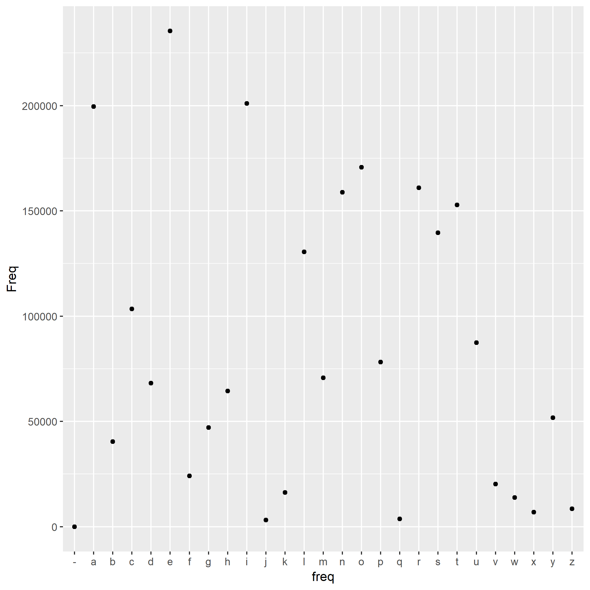
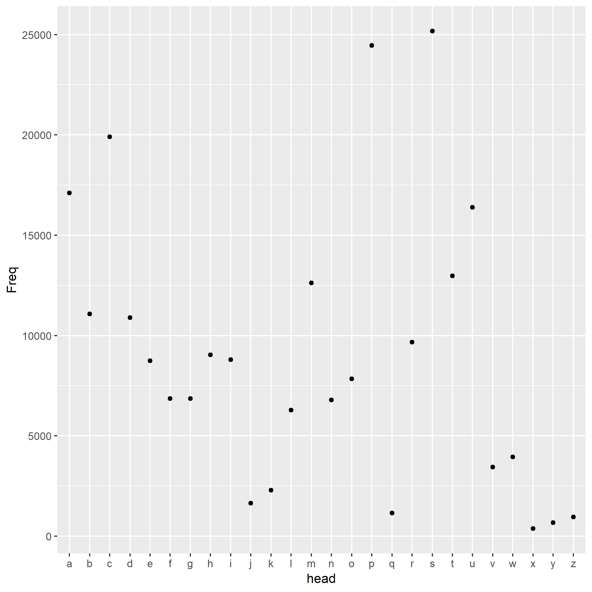
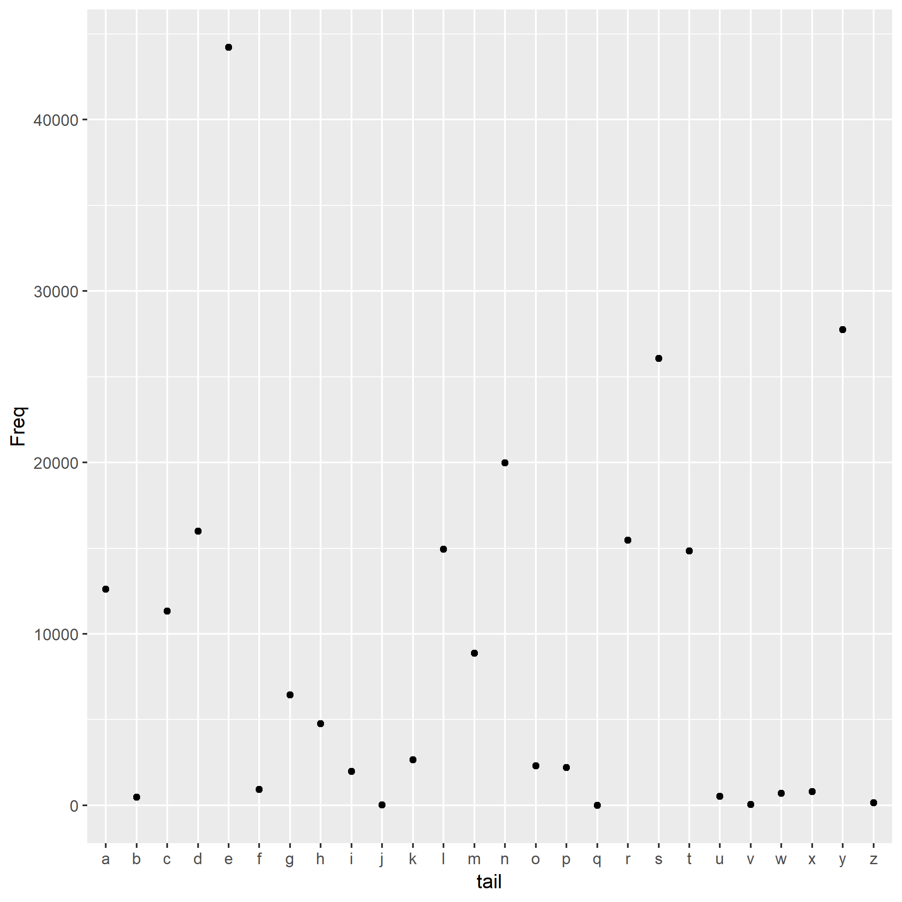

In this report, I explore the `words.txt` further to see if there's more interesting things. Again, it contains 235970 words.

## Letter frequency

First I split the words into letters and calculate the frequency at a letter level.

The most frequent letter is e. I also noticed that there's dash `"-"` in the words. 

Here is a histogram of letter frequency.

## Head letter frequency

Then I try the head letter of the words and see if there's any fancy things.

The most frequent head letter is s.

Here is a histogram of head letter frequency.

## Tail letter frequency

Finally I try the tail letter of the words and do it all again.

The most frequent tail letter is e.

Here is a histogram of tail letter frequency.

